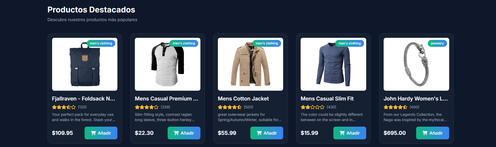

# 🛒 ShopVerse - Tu universo de compras

Bienvenido a **ShopVerse**, una tienda en línea moderna centrada en tecnología, moda y productos destacados. Este proyecto fue creado como una tienda dinámica, visual y funcional, utilizando tecnologías modernas como **HTML, Tailwind CSS y JavaScript** con conexión a la API pública de [FakeStore](https://fakestoreapi.com/).

---

## 🚀 Funcionalidades principales

- 🛍️ Catálogo de productos dinámico
- 📦 Carrito de compras interactivo
- 📱 Menú móvil responsive
- 🔍 Filtro por categorías
- 🎉 Ofertas con temporizador en vivo
- 🎨 Animaciones y diseño tipo “glassmorphism”
- 💬 Notificaciones al añadir al carrito
- 💾 Guardado de carrito en `localStorage`
- 📷 Modal con detalles del producto

---

## 🖼️ Capturas de pantalla

1. Pantalla de inicio  

2. Productos destacados  

3. Modal de detalle de producto  

4. Carrito con productos  


## ⚙️ Tecnologías utilizadas

- HTML5
- Tailwind CSS
- JavaScript 
- Font Awesome
- Swiper.js (slider de testimonios)
- FakeStore API

---

## 💻 Cómo ejecutar este proyecto

1. Clona el repositorio:

```bash
git clone https://github.com/Ricardo-Palomino/proyecto-de-Javascript.git
```


2. Abre el proyecto en Visual Studio Code o tu editor favorito.

3. Abre el archivo index.html con Live Server o tu navegador.

* Si usas Live Server, haz clic derecho sobre index.html y selecciona “Open with Live Server”.

📁 Estructura de carpetas
```bash
/shopverse
│
├── index.html               # Página intro
├── style.css                # Estilos personalizados (usa Tailwind)
├── main.js                  # Lógica JS pagina intro
├── /tienda                  # Archivos pagina principal
│   ├── tienda.html           
│   ├── tienda.css
│   └── tienda.js
    /IMG                      # Multimedia
│   ├── imagen          
│   ├── imagen
│   └── imagen
 ```
 
🤝 Autor

Creado por [@Ricardo P].


📬 Contacto
¿Tienes sugerencias, mejoras o errores? No dudes en contactarme
